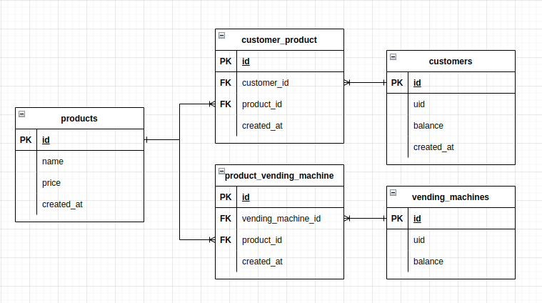

## First assignment - Vending Machine

### Installation:

pip install --editable .

### How to use:

Main command `vm` opens menu with available command:

```commandline
Commands:
  balance   Balance of Vending Machine
  customer  Show customer info
  select    Select product by id
  show      Display all products of Vending Machine
```

Example of commands:

- display all product: `vm show`
- put balance to Vendor Machine: `vm balance put 100`
- withdraw balance from Vendor Machine: `vm balance withdraw`
- show customer info: `vm customer info`
- select the product with id = 1: `vm select 1`

### Database model:

Database: SQLite

